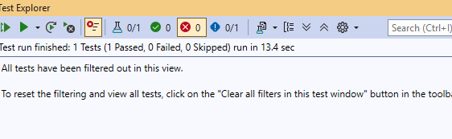

# OrangeHRM Automation Testing Framework

## Project Overview
This project is built using C#, Selenium WebDriver, NUnit, and Page Object Model (POM). It automates OrangeHRM login and dashboard validation scenarios.

## Tools Used
- C#
- Selenium WebDriver
- NUnit
- Page Object Model (POM)
- Git
- GitHub
- ChromeDriver

# Screenshots
### GitHub Repository

### Login Page

### Dashboard Page

### Test Execution Result

